  <h1 align="center">Olá, eu sou Juliano Ballarini 👋</h1>
  <h3 align="center">Desenvolvedor Full-Stack | Especialista em Integrações | SaaS & Mobile</h3>
  
  

    
    
  

---

### 🚀 Sobre Mim

Sou um Desenvolvedor Full-Stack apaixonado por criar soluções de integração, e-commerces, SaaS e aplicativos mobile. Meu foco é construir sistemas escaláveis, integrados e de alta performance. Tenho vasta experiência prática em desenvolvimento multiplataforma, automação de processos e integrações via API.

- 🔭 Atualmente trabalhando em **BallaPDF**, **Perseus Hub** e **Legado em Movimento**.
- 🌱 Aprendendo e aprimorando **.NET 9**, **Blazor** e arquiteturas escaláveis.
- 💬 Pergunte-me sobre **Python (FastAPI), React, Next.js, Flutter e Integrações de E-commerce**.
- ⚡ Curiosidade: Sou apaixonado por criar e desenvolver soluções que resolvem problemas reais.

---

### 🛠️ Tech Stack

#### Backend & Linguagens

#### Frontend & Mobile

#### Bancos de Dados

#### Infra & Ferramentas

---

### 📊 GitHub Stats

  <a href="https://github.com/jsballarini">
  
  <!-- Metrics (Simple & Classic) -->
  
  
   

  <!-- Streak Stats -->
  
  </a>

---

### 💼 Projetos em Destaque

| Projeto | Descrição | Stack Principal |
| :--- | :--- | :--- |
| **BallaPDF** | Gerador de PDF/A-4f com Compliance e verificação veraPDF. | `Python` `FastAPI` `PostgreSQL` |
| **Perseus Hub** | Sistema de Integração Backoffice para Instituições de Ensino. | `.NET 9` `Blazor` `SQL Server` |
| **Legado em Movimento** | Novo sistema social para empréstimo de cadeiras de rodas. | `Node.js` `Express` `React` |
| **Autoralis** | Registro digital de direitos autorais com provas criptográficas. | `PHP` `WordPress` `WooCommerce` |
| **PetStore.com.br** | E-commerce pet com integração de app mobile. | `WooCommerce` `Flutter` |

---

### 🧩 Metodologia

- **Clean Code:** Código modular, limpo e bem documentado.
- **Boas Práticas:** Componentização, reutilização e padrões de projeto.
- **Commits:** Padronização com Conventional Commits.
- **Documentação:** README.md, CHANGELOG.md e TODO.md sempre atualizados.

---

  
Feito com ❤️ por <a href="https://github.com/jsballarini">Juliano Ballarini</a>

